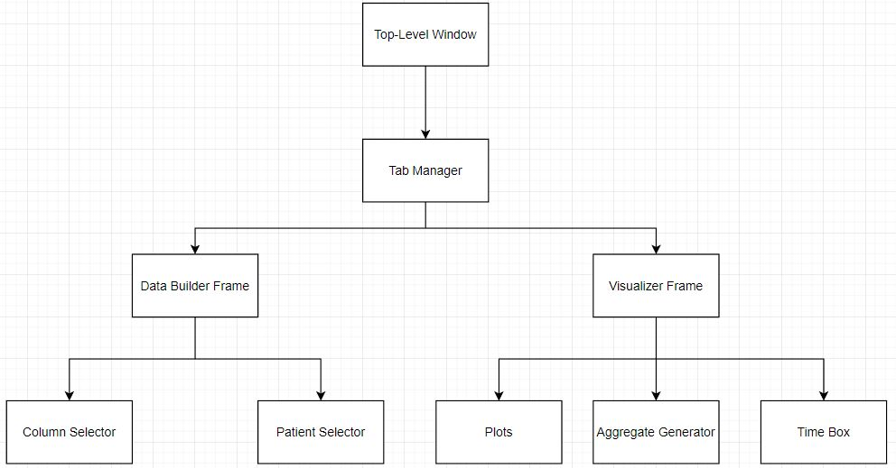

# Midterm Progress
10/22/2022

## Project Description
Develop a desktop application to visualize Embrace2 datasets  
Provide a platform for data analysts to create unique views of Embrace2 data

## Team Structure
Derek Osborne - Project Manager - ZenHub / Designer / Reviewer  
Brad Adams - Software Developer - Backend  
Luke Rappa - Software Developer - UI / Layout  
Brenan Patrick - Software Developer - UI / Data Builder Tab  
Will Simpson -  Software Developer - UI / Data Visualization  

In terms of development, we help each other out in each item.  
Everyone is a developer on some item.  
Most of the team is unfamiliar with Python, Matplot, and tkinter

## Features Planned for Project
- Develop a desktop application to visualize Embrace2 datasets
  - Provide UI to load individual datasets
    - Allow user to select which dimensions to load
    - Allow user to set if using UTC or Local System Time
  - Provide UI to visual loaded datasets
    - Use appropriate time series plots for each dimension selected
    - Provide UI to adjust the time window of the plots
    - Provide UI to zoom in / out of plots
    - Provide synchronization of plots based on time window
    - Provide UI to generate aggregate data for a data set

## Design of the Project
  
- Key Ideas
  - One Top Level Window
    - Manage tabs and views created by user
  - One Data Builder Frame
    - UI for building dataset based on user parameters
  - Multiple Visualizer Frames
    - Contain X plots based on what user loads
    - Contains widgets to interact with data (specific to plots)
    - Contain Time Box to change date range of all plots synchronously
  - Composition
    - Lifetimes are bound to lifetime of the parent object
    - Allows easy closing of Visualizer Frames, let Garbage Collector clean up components

## Technology to Accomplish Project
- Application
  - Python 3.7+
  - Matplotlib
  - Tkinter
- Development
  - GitHub
  - ZenHub Extension
  - Diagrams.net

## Prototyping Results (Demo)
- Data Builder Frame
  - Can locate specific CSVs in a local directory
  - Can select which columns to load from CSVs
  - Can trigger event to create a new frame with plots based on user config

To-Do:
- Create Backend of Visualizer Frame
  - Data Frame that keeps a time window
  - Synchronize multiple plot, not just one plot
  - Plot Tool Bars
  - UTC to Local Time Switch
- Clean Up Data Builder Frame UI
  - Other optional buttons or configurations

## Timeline / Adjustments
- Priorities remain the same
- Next 2 sprints should cover visualizer frame
- Might be close on UTC to Local Time Switch and lower priority items